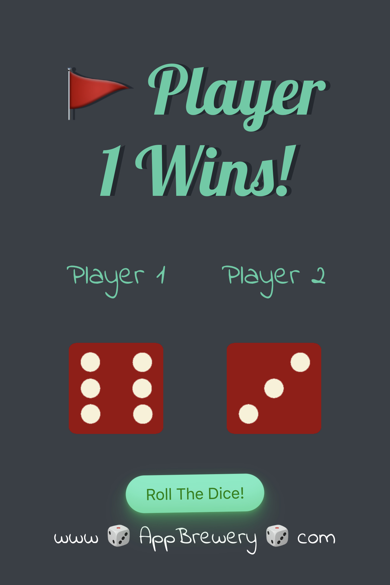
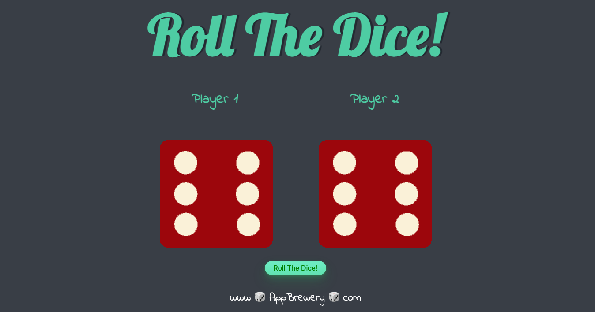

# Random Dice

In this project I practiced by rewriting the html & css based on skeleton project looks on the browser. 
Learned about basic JS & DOM manipulation. Added bootstrap for responsiveness on all window sizes.

Check it out on my github page: [SageBaram.github.io/randomDice](https://sagebaram.github.io/randomDice/)

## Usage

- When the page is loaded, the dice images are set to 6. Both the big heading and the button at the bottom are clickable. 
- Player 1 is set to the left dice, Player 2 is set to the right dice.
- When clicking the big heading or the button to "Roll The Dice!" it runs the script inside [randomDice.js](randomDice/randomDice.js):
   - It generates two random numbers between 1-6.
   - It sets the `src` attribute by querying both selectors and concatenating the numbers value to the image path.
   - It sets the `big-header` or the `<h1>` element's text content to display the winner/draw instead.

Was a simple & fun project. There is not much in it but feel free to code review and open an [issue](https://github.com/SageBaram/randomDice/issues/new) or a PR.

 ##  On mobile:

  </img>

## On Desktop:

